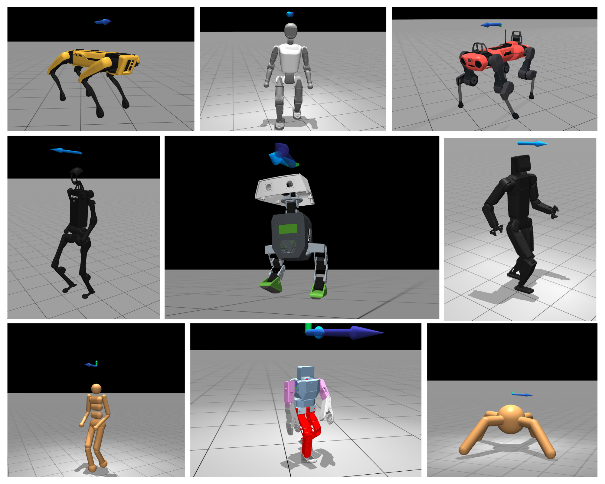

<div align="center">
  <h1>Velocity Hub</h1>
</div>


<div align="center">
  <a href="https://velocity-hub.tech/" target="_blank">
    
  </a>
</div>

<div align="center">
  <a href="https://velocity-hub.tech/" target="_blank">
    <strong>:rocket: Live Demo</strong>
  </a>
</div>


<p align="center"><strong>Velocity Hub</strong> is a small collection of reinforcement learning environments designed to train bipeds and quadrupeds to follow velocity commands</p>

<p align="center">Two variations to accommodate all users:</p>

<div align="center">
<table>
<tr>
<td align="center"><a href="/velocity_mjlab">🪛 velocity_mjlab</a></td>
<td align="center"><a href="/velocity_mujoco_playground">🛝 velocity_mujoco_playground</a></td>
</tr>
</table>
</div>


<h2 align="center">Supported Robots</h2>

<div align="center">

| Robot | Type | Actuator | Actuator Type | DOF |
|-------|------|----------|---------------|-----|
| Duck Mini | Biped | STS3215 | Servo | 14 |
| KScale Zbot | Humanoid | STS3215 | Servo | 18 |
| KScale KBot | Humanoid | RobStride | QDD | 20 |
| Booster T1 | Humanoid | Proprietary | QDD | 23 |
| Unitree H1 | Humanoid | M107 | QDD | 19 |
| ANYmal C | Quadruped | ANYdrive 3.0 | SEA | 12 |
| Boston Dynamics Spot | Quadruped | Proprietary | QDD | 12 |

</div>

<!-- TODO: Add individual robot images/gifs here -->


## ⚡ Quickstart

```bash
git clone https://github.com/i1Cps/velocity-hub.git
```

### 🛝 Velocity Mujoco Playground

```bash
cd ~/velocity-hub/velocity_mujoco_playground
uv run train --env=zbot
```

Play scripts allow you to interact with your trained policy in the MuJoCo viewer.

```bash
uv run play --env=zbot
```

### 🪛 Velocity MjLab

```bash
cd ~/velocity-hub/velocity_mjlab
uv run train Mjlab-Velocity-Flat-Booster-T1 --env.scene.num-envs 4096 --agent.run-name booster_t1_velocity
```

Play scripts allow you to interact with your trained policy in the MuJoCo viewer.

```bash
uv run play Mjlab-Velocity-Flat-Booster-T1 --wandb-run-path <user>/<project>/<run_id>
uv run play Mjlab-Velocity-Flat-Booster-T1 --checkpoint-file logs/rsl_rl/booster_t1_velocity/model.pt
```


## Dependencies

[](https://mujoco.readthedocs.io/en/stable/overview.html)
[](https://docs.jax.dev/en/latest/quickstart.html)
[](https://www.nvidia.com/en-gb/geforce/drivers/)


## Credits

Developed by [**Theo Moore-Calters**](https://www.linkedin.com/in/theo-moore-calters/)

[](https://github.com/i1Cps)
[](https://linkedin.com/in/theo-moore-calters)

## License

This project is licensed under the MIT License.
See the [LICENSE](./LICENSE) file for details.
