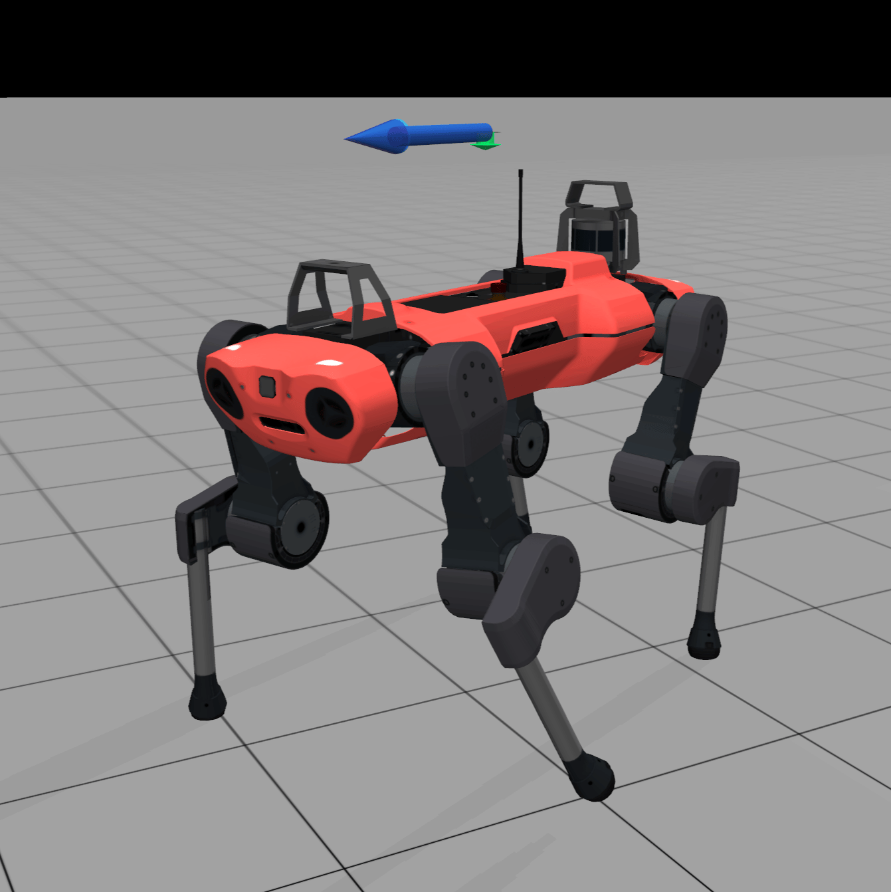
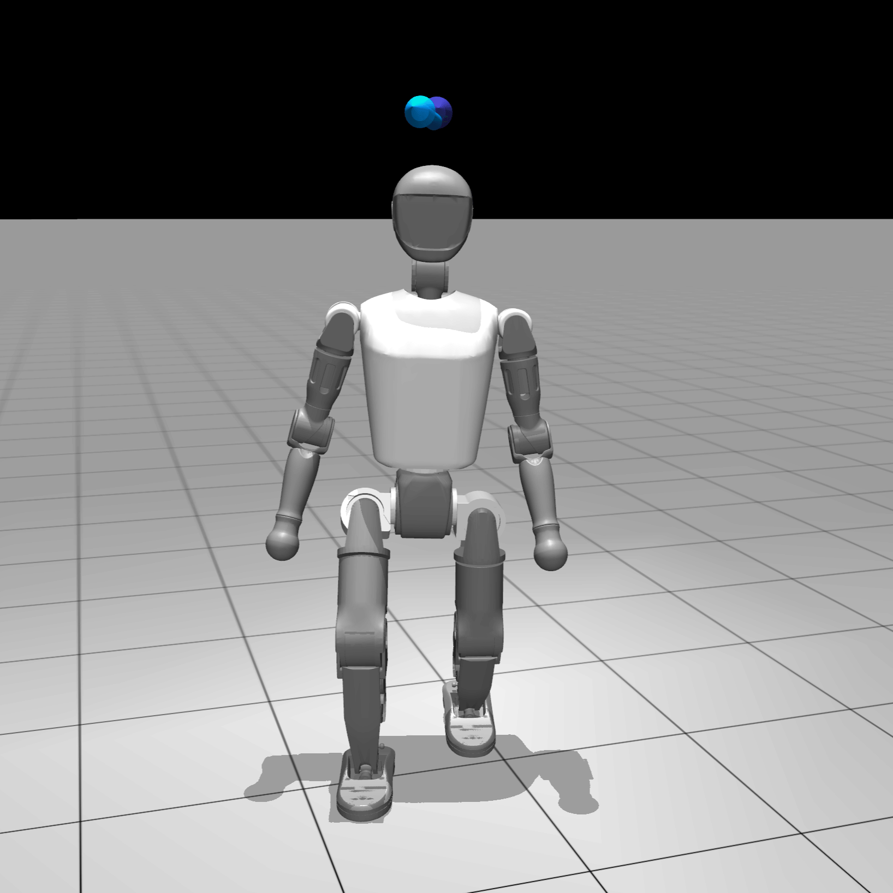
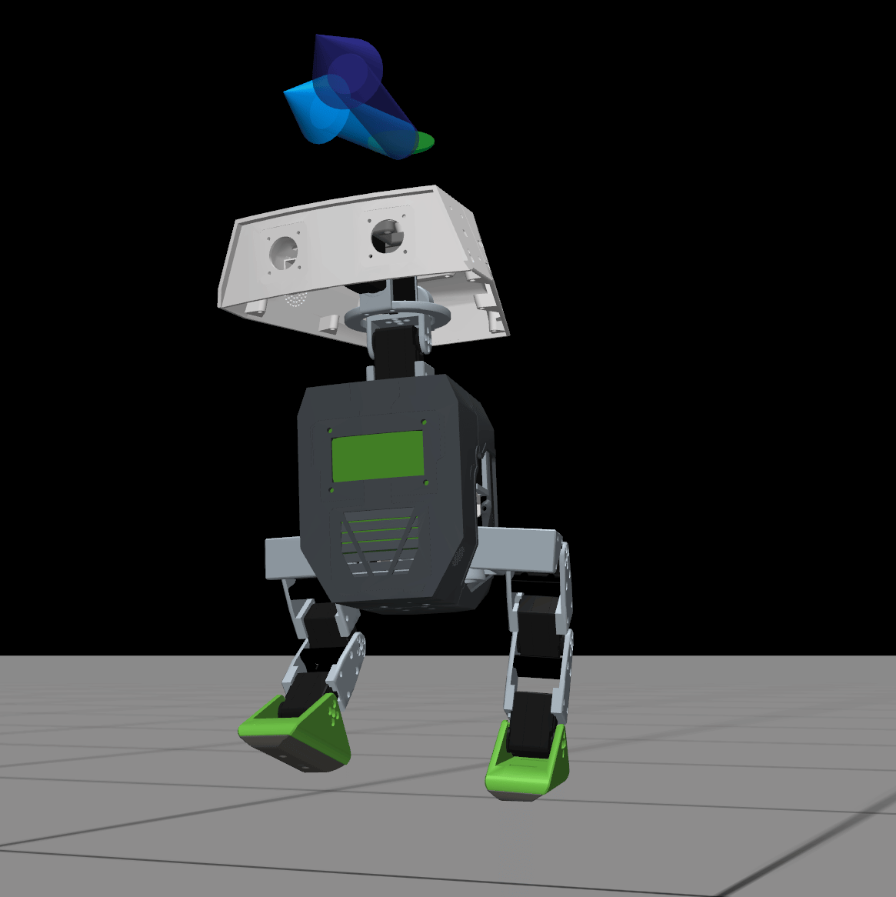
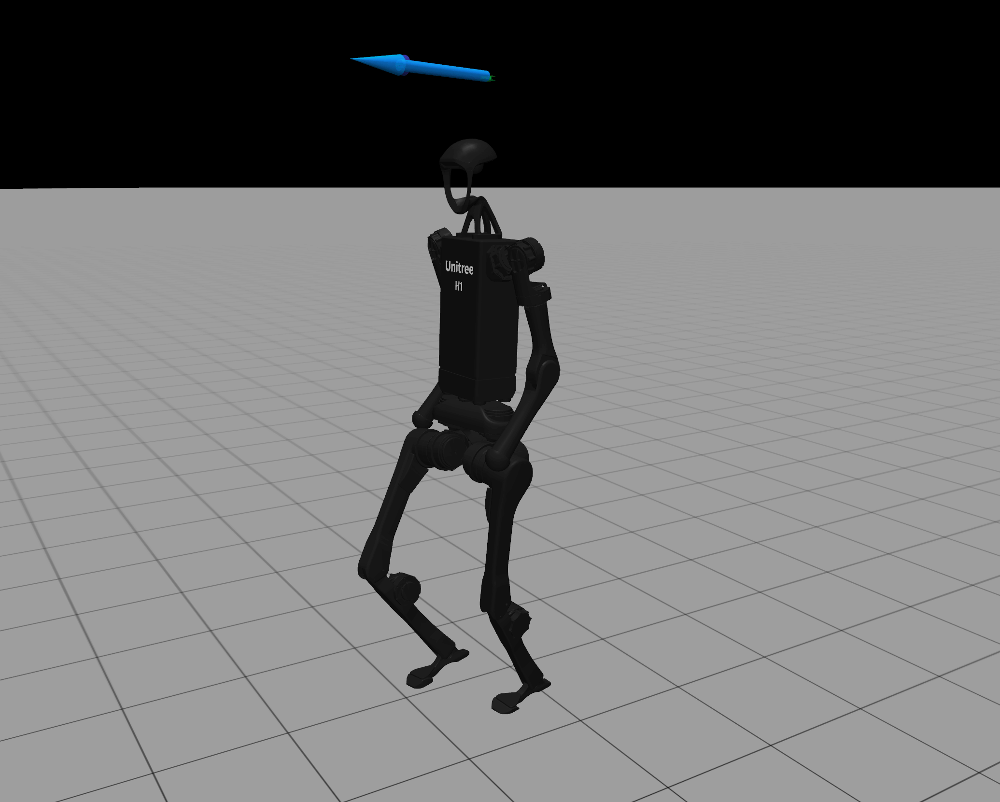
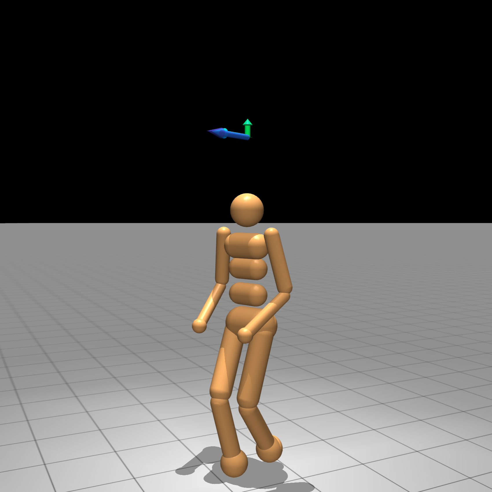
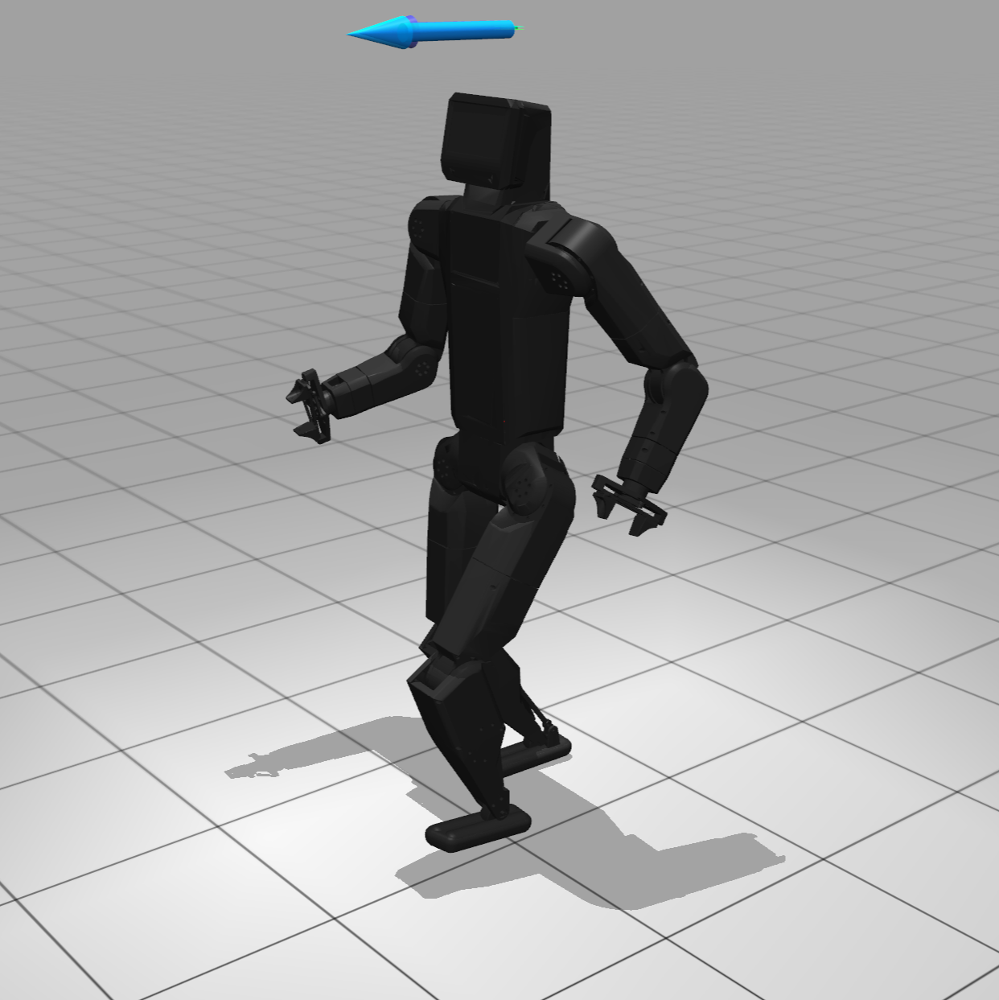
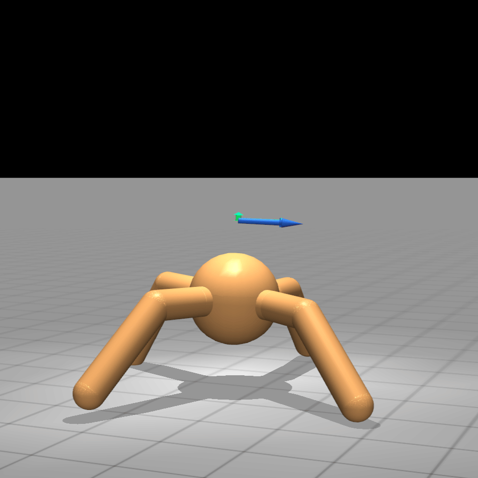
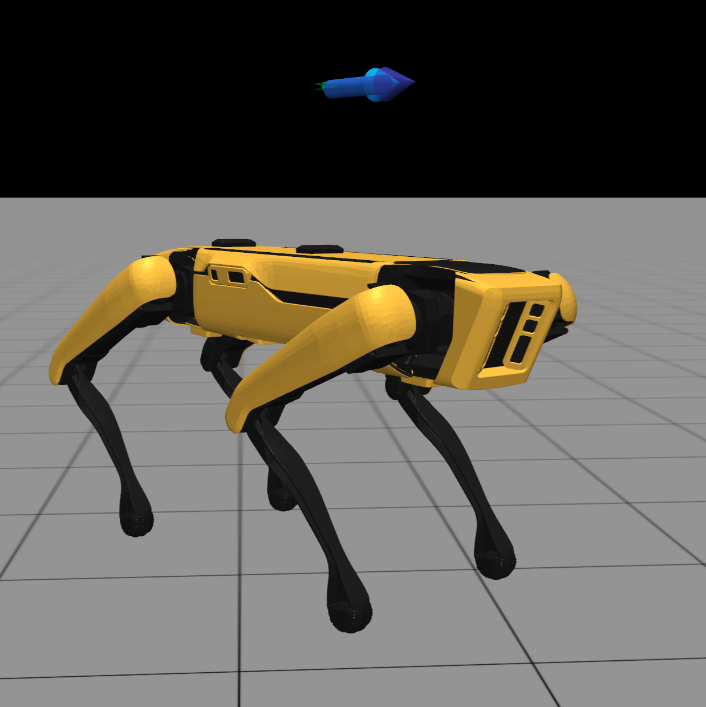
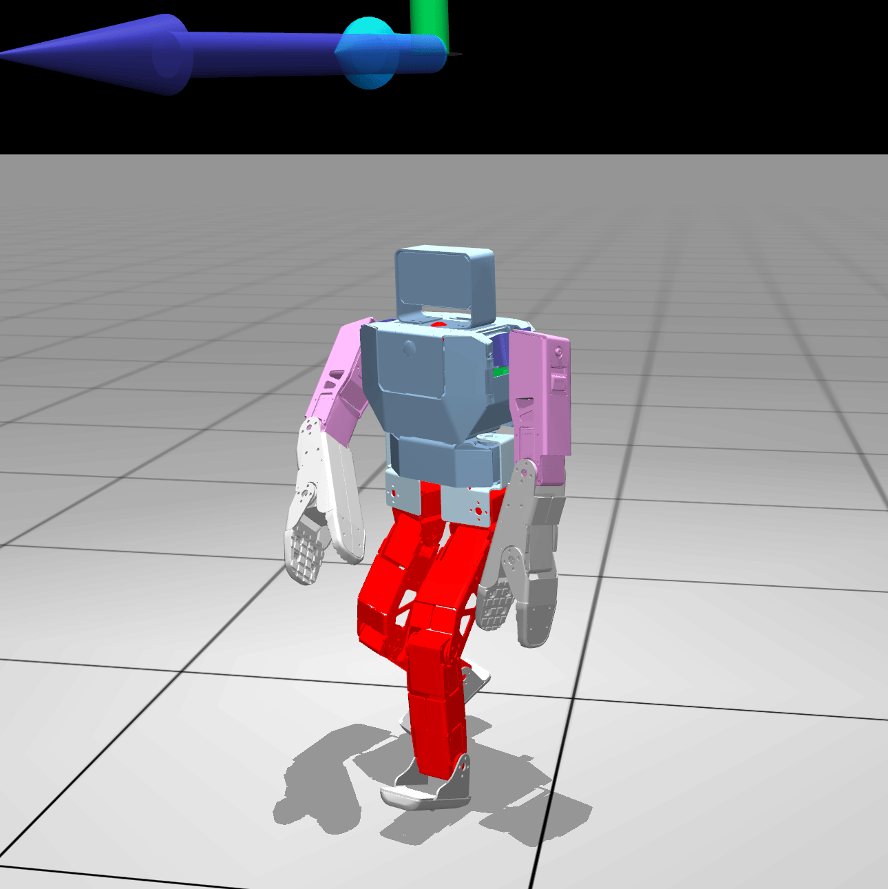

<h1 align="center">🪛 Velocity MjLab</h1>

<p align="center">The MjLab side of Velocity Hub is geared towards sim2real users and those looking for silky smooth gaits out of the box. Configure accurate actuators, inject realisitic motor and sensor noise all in MjLab. Policies take 1–2 hours to train on a modern GPU, but the result is a strong sim2real policy requiring minimal environment tuning</p>


## Environments

<div align="center">

| ANYmal C | Booster T1 | Duck Mini | Unitree H1 |
| --- | --- | --- | --- |
|  |  |  |  |

| Humanoid | Kbot | Quadruped | Spot | Zbot |
| --- | --- | --- | --- | --- |
|  |  |  |  |  |

</div>

## Training Command Examples:

```bash
uv run train Mjlab-Velocity-Flat-Booster-T1 --env.scene.num-envs 4096 --agent.run-name booster_t1_velocity
```
```bash
uv run train Mjlab-Velocity-Flat-Duck-Mini --env.scene.num-envs 4096 --agent.run-name duck_mini_velocity
```
```bash
uv run train Mjlab-Velocity-Flat-Unitree-H1 --env.scene.num-envs 4096 --agent.run-name unitree_h1_velocity
```
```bash
uv run train Mjlab-Velocity-Flat-Spot --env.scene.num-envs 4096 --agent.run-name spot_velocity
```

Checkpoints are saved to `logs/rsl_rl/<experiment_name>/`. If wandb is configured on your system, runs are automatically logged to your account.

## Evaluate policies using the play files

### Pretrained models (ships with this repo)

```bash
uv run play Mjlab-Velocity-Flat-Booster-T1 --checkpoint-file logs/rsl_rl/booster_t1_velocity/model.pt
```

### Local checkpoint from your own training run

```bash
uv run play Mjlab-Velocity-Flat-Booster-T1 --checkpoint-file logs/rsl_rl/booster_t1_velocity/model_10000.pt
```

### From a wandb run

```bash
uv run play Mjlab-Velocity-Flat-Booster-T1 --wandb-run-path <entity>/<project>/<run-id>
```

The play script opens an interactive viewer with keyboard velocity control:

| Key | Command |
| --- | --- |
| UP / DOWN | lin_vel_x +/- |
| J / L | lin_vel_y +/- |
| LEFT / RIGHT | ang_vel_z +/- |
| K | zero all commands |
| ENTER | reset environment |
