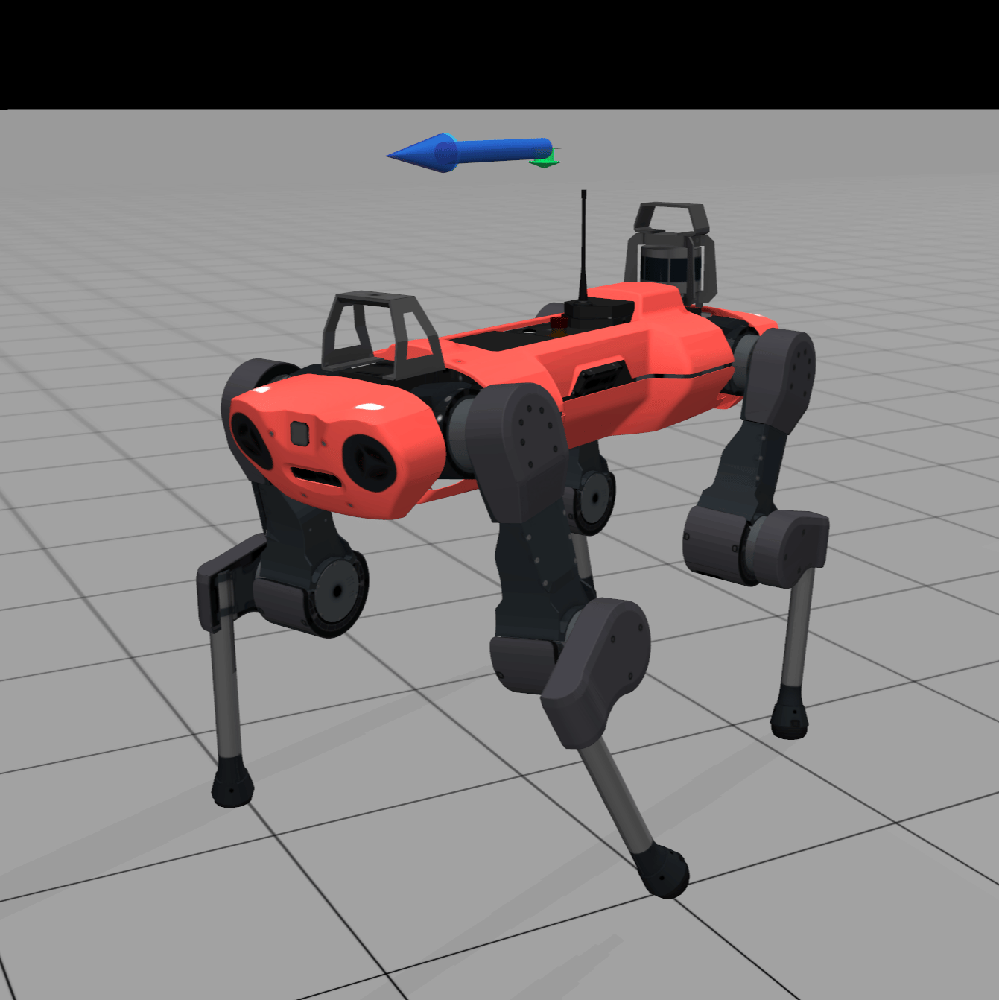
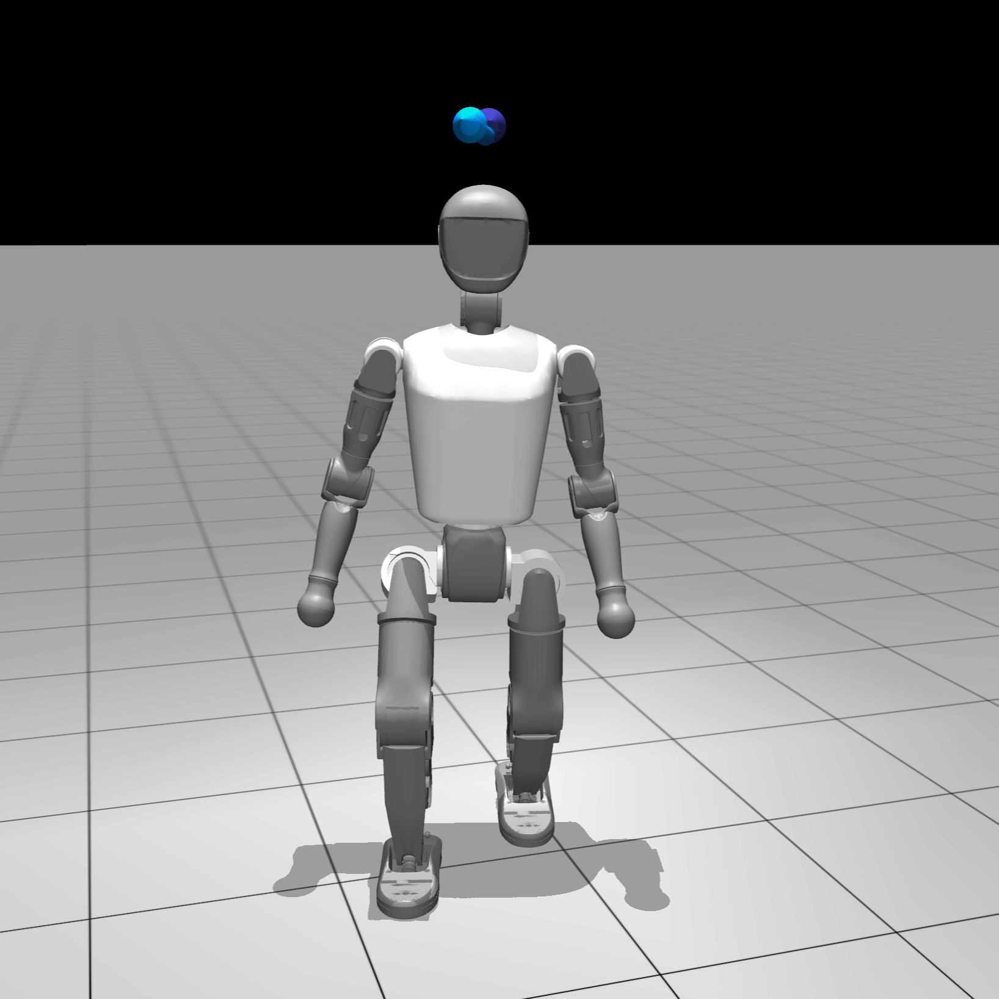
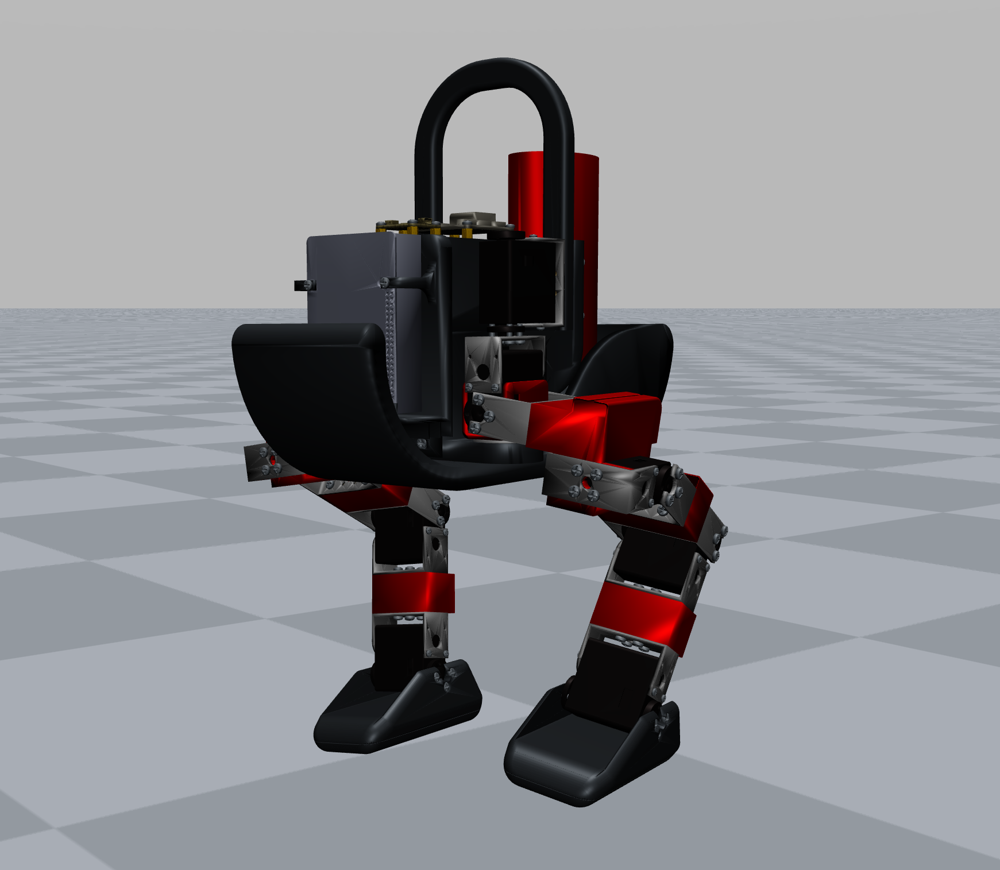
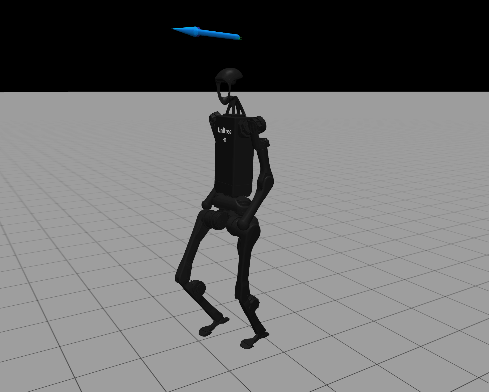
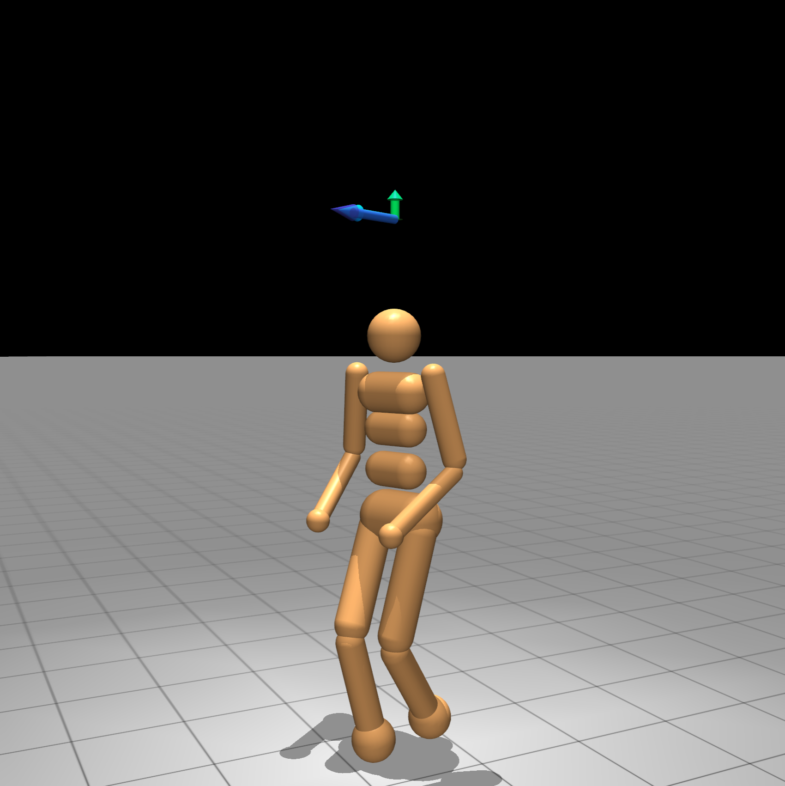
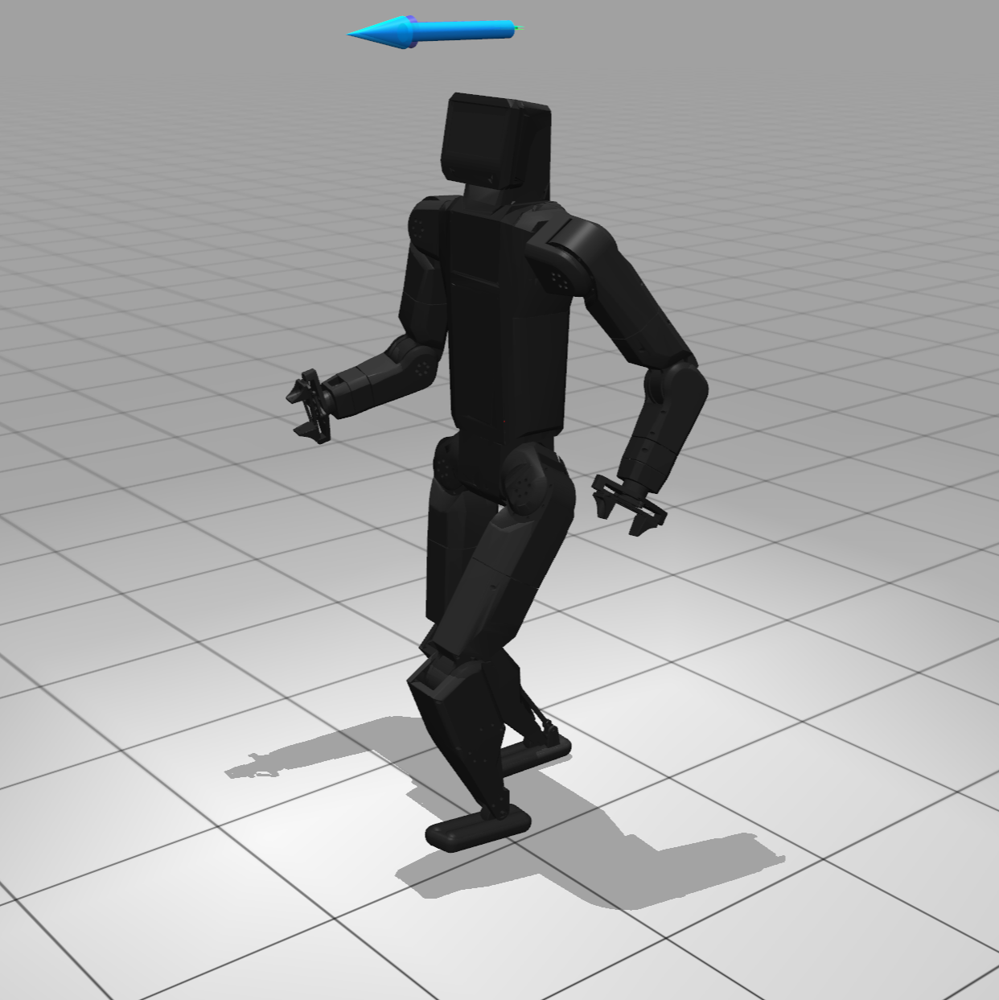
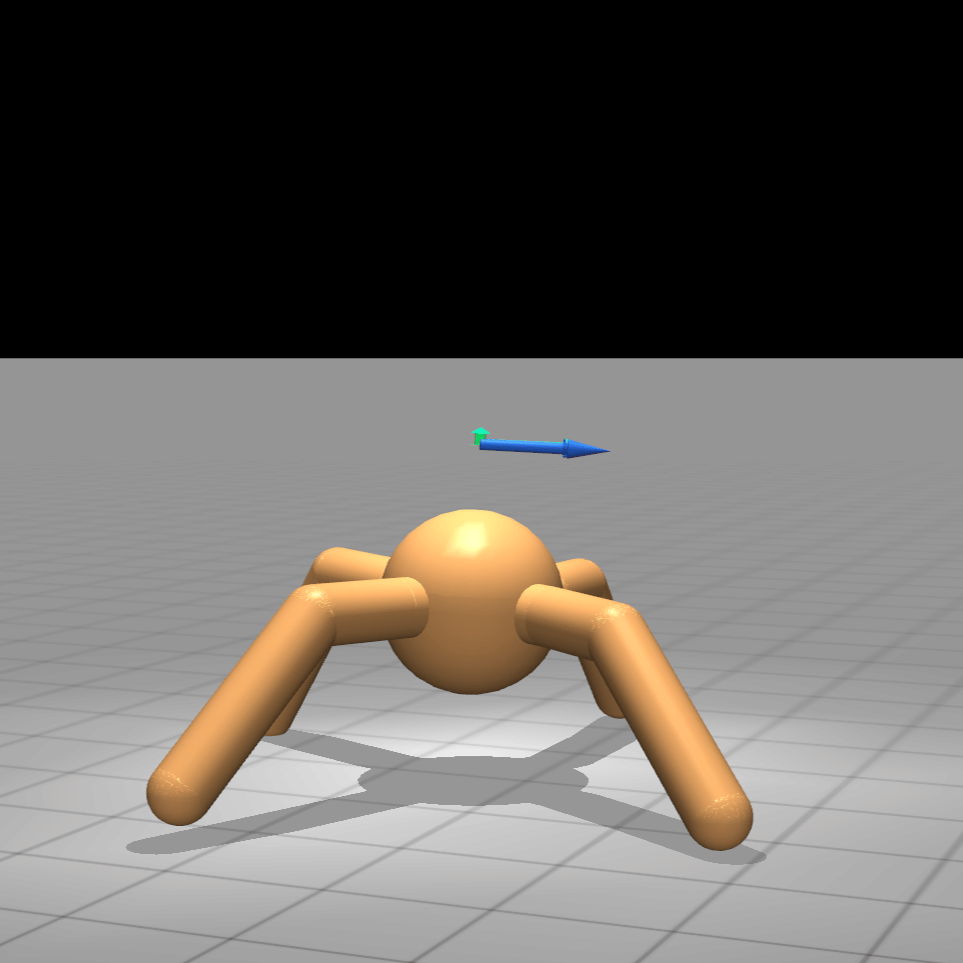
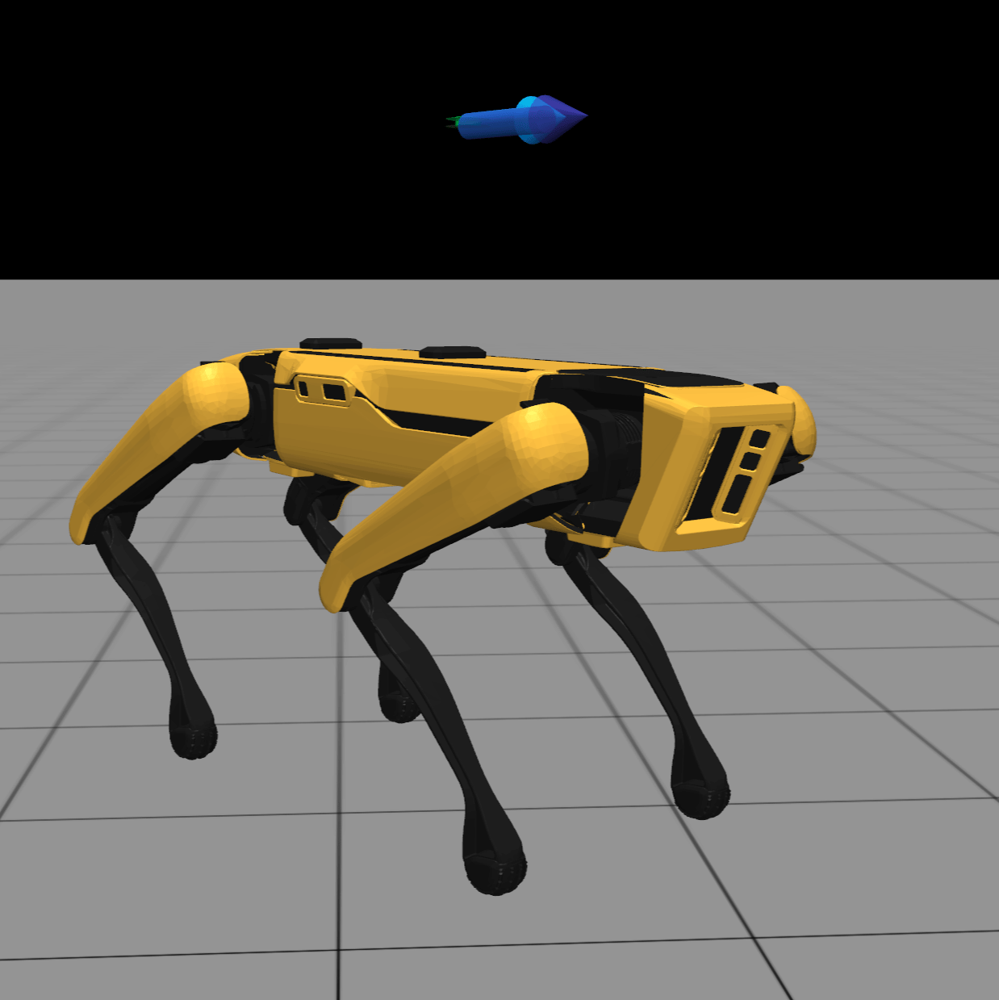
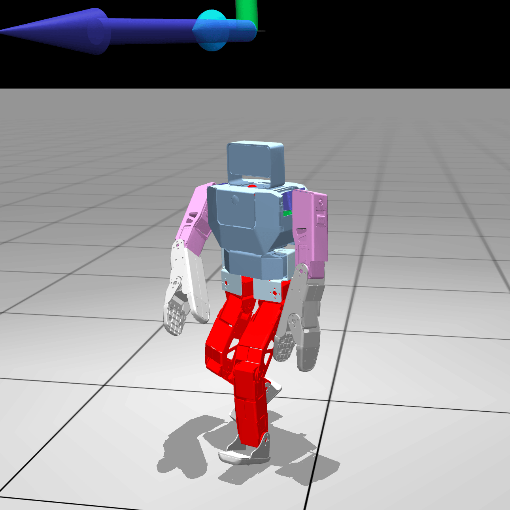

<h1 align="center">🪛 Velocity MJLab</h1>

<p align="center">The MJLab side of Velocity Hub is geared towards sim-to-real users and those looking for silky smooth gaits out of the box. Configure accurate actuators and inject realistic motor and sensor noise in MJLab. Policies take 1–2 hours to train on a modern GPU, producing strong sim-to-real policies with minimal environment tuning.</p>


## Environments

<div align="center">

| ANYmal C | Booster T1 | Duck Mini Pro Headless | Unitree H1 |
| --- | --- | --- | --- |
|  |  |  |  |

| Humanoid | Kbot | Quadruped | Spot | Zbot |
| --- | --- | --- | --- | --- |
|  |  |  |  |  |

</div>

Duck Mini Pro Headless is the 10-DOF biped used for the physical sim-to-real deployment. Its MJLab model includes the measured ST3025 [BAM](https://github.com/Rhoban/bam) actuator fit, passive backlash, command and sensor delay, encoder bias, and TPU sole contacts.

The canonical `Mjlab-Velocity-Flat-Duck-Mini-Pro` task keeps that measured BAM setup. `Mjlab-Velocity-Flat-Duck-Mini-Pro-Website` changes only the actuator to a native MuJoCo position controller, giving the browser demo a policy trained against the same controller that MJSwan executes.

## Training Command Examples

```bash
uv run train Mjlab-Velocity-Flat-Booster-T1 --env.scene.num-envs 4096 --agent.run-name booster_t1_velocity
```
```bash
uv run train Mjlab-Velocity-Flat-Duck-Mini-Pro --env.scene.num-envs 4096 --agent.run-name duck_mini_pro_velocity
```
```bash
uv run train Mjlab-Velocity-Flat-Duck-Mini-Pro-Website --env.scene.num-envs 4096 --agent.run-name duck_mini_pro_website_position
```
```bash
uv run train Mjlab-Velocity-Flat-Unitree-H1 --env.scene.num-envs 4096 --agent.run-name unitree_h1_velocity
```
```bash
uv run train Mjlab-Velocity-Flat-Spot --env.scene.num-envs 4096 --agent.run-name spot_velocity
```

Checkpoints are saved to `logs/rsl_rl/<experiment_name>/<run_directory>/`. If Weights & Biases is configured on your system, runs are automatically logged to your account.

## Evaluate policies

### Pretrained models (ship with this repo)

```bash
uv run play Mjlab-Velocity-Flat-Booster-T1 --checkpoint-file logs/rsl_rl/booster_t1_velocity/model.pt
uv run play Mjlab-Velocity-Flat-Duck-Mini-Pro --checkpoint-file logs/rsl_rl/duck_mini_pro_velocity/model.pt
```

### Local checkpoint from your own training run

```bash
uv run play Mjlab-Velocity-Flat-Booster-T1 --checkpoint-file logs/rsl_rl/booster_t1_velocity/<run_directory>/model_<iteration>.pt
```

### From a wandb run

```bash
uv run play Mjlab-Velocity-Flat-Booster-T1 --wandb-run-path <entity>/<project>/<run-id>
```

The play script opens an interactive viewer with keyboard velocity control:

| Key | Command |
| --- | --- |
| UP / DOWN | lin_vel_x +/- |
| J / L | lin_vel_y +/- |
| LEFT / RIGHT | ang_vel_z +/- |
| K | zero all commands |
| ENTER | reset environment |
